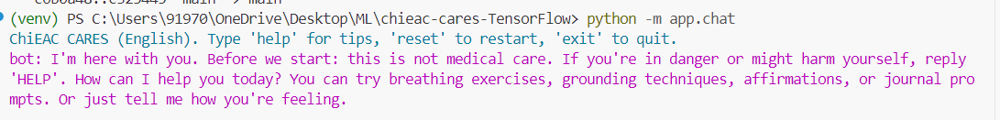
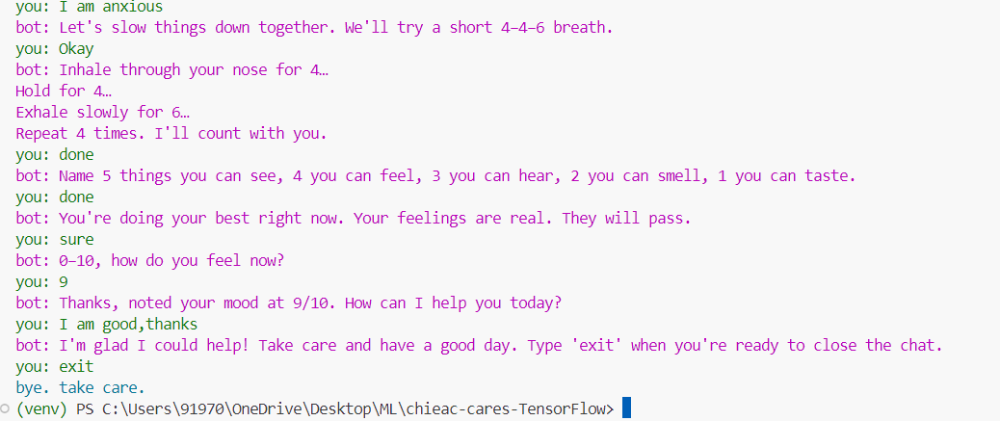

# How to Run ChiEAC CARES Chatbot

This guide will walk you through setting up and running the ChiEAC CARES chatbot on your local machine.

> **📸 Adding Screenshots:** To include screenshots in this guide, save them in a `docs/images/` or `images/` folder and reference them using: ``. See examples below.

## 📋 Prerequisites

Before you begin, make sure you have:

1. **Python 3.8 or higher** installed on your computer
   - Check your Python version: Open terminal/command prompt and type `python --version`
   - If Python is not installed, download it from [python.org](https://www.python.org/downloads/)

2. **Git** (optional, only if cloning from GitHub)
   - Download from [git-scm.com](https://git-scm.com/downloads)

3. **Terminal/Command Prompt** access
   - **Windows**: PowerShell or Command Prompt
   - **Mac/Linux**: Terminal

## 🚀 Step-by-Step Installation

### Step 1: Get the Project Files

**Option A: Clone from GitHub (if repository is public)**
```bash
git clone https://github.com/yourusername/chieac-cares-tensorflow.git
cd chieac-cares-tensorflow
```

**Option B: Download ZIP file**
1. Download the project ZIP file
2. Extract it to a folder on your computer
3. Open terminal/command prompt and navigate to the extracted folder:
   ```bash
   cd path/to/chieac-cares-tensorflow
   ```

### Step 2: Create a Virtual Environment (Recommended)

A virtual environment keeps project dependencies isolated from other Python projects.

**Windows:**
```bash
python -m venv venv
venv\Scripts\activate
```

**Mac/Linux:**
```bash
python3 -m venv venv
source venv/bin/activate
```

You should see `(venv)` at the beginning of your command prompt, indicating the virtual environment is active.

### Step 3: Install Dependencies

Install all required Python packages:

```bash
pip install -r requirements.txt
```

This will install:
- TensorFlow (for the ML model)
- NumPy, Pandas (for data processing)
- PyYAML (for reading flow files)
- Colorama (for colored terminal output)
- And other necessary libraries

**Note:** This may take a few minutes, especially TensorFlow installation.

### Step 4: Verify Installation

Check that everything is installed correctly:

```bash
python -c "import tensorflow as tf; print('TensorFlow version:', tf.__version__)"
```

You should see the TensorFlow version printed (e.g., "TensorFlow version: 2.10.0").

## 💬 Running the Chatbot

### Start the Chatbot

Once everything is installed, run:

```bash
python -m app.chat
```

You should see:
```
ChiEAC CARES (English). Type 'help' for tips, 'reset' to restart, 'exit' to quit.
bot: I'm here with you. Before we start: this is not medical care. If you're in danger or might harm yourself, reply 'HELP'. How can I help you today? You can try breathing exercises, grounding techniques, affirmations, or journal prompts. Or just tell me how you're feeling.
you: 
```


*Screenshot: Chatbot startup screen showing the welcome message*

The chatbot is now running and waiting for your input!

## 🎮 How to Use

### Basic Commands

- **Type your message** and press Enter to send
- **`help`** or **`?`** - Show available options
- **`reset`** - Restart the current conversation flow
- **`exit`** - End the conversation and close the chatbot

### Example Conversations

**Starting a Breathing Exercise:**
```
you: I am anxious
bot: Let's slow things down together. We'll try a short 4–4–6 breath.
you: Okay
bot: Inhale through your nose for 4…
Hold for 4…
bot: Let's slow things down together. We'll try a short 4–4–6 breath.
you: Okay
bot: Inhale through your nose for 4…
Hold for 4…
Hold for 4…
Exhale slowly for 6…
Repeat 4 times. I'll count with you.
you: Done
bot: Name 5 things you can see, 4 you can feel, 3 you can hear, 2 you can smell, 1 you can taste.
you: Done
bot: Name 5 things you can see, 4 you can feel, 3 you can hear, 2 you can smell, 1 you can taste.
bot: Name 5 things you can see, 4 you can feel, 3 you can hear, 2 you can smell, 1 you can taste.
you: I am done
bot: You're doing your best right now. Your feelings are real. They will pass.
you: Sure
bot: 0–10, how do you feel now?
you: 8
bot: Thanks, noted your mood at 8/10. How can I help you today?
you: I am good
bot: I'm glad I could help! Take care and have a good day. Type 'exit' when you're ready to close the chat.
you: exit
bye. take care.
```


*Screenshot: Example conversation showing the breathing exercise flow*

**Asking for Help:**
```
you: help
bot: Try: 'breathing', 'grounding', 'affirmation', 'journal', or describe how you feel. Use 'reset' to restart a flow.
```

### What You Can Say

The chatbot recognizes various emotional states and requests:

- **Emotional States:**
  - "I'm anxious" / "I feel anxious"
  - "I'm angry" / "I feel angry"
  - "I'm sad" / "I feel sad"
  - "I feel numb" / "I'm dissociating"

- **Specific Requests:**
  - "breathing exercises"
  - "grounding techniques"
  - "affirmations"
  - "journal prompts"

- **General Feelings:**
  - "I'm overwhelmed"
  - "I need support"
  - "I'm having a hard time"

## 🔧 Troubleshooting

### Issue: "ModuleNotFoundError: No module named 'app'"

**Solution:** Make sure you're running the command from the project root directory:
```bash
# Check you're in the right folder
# You should see folders like: app/, nlu/, content/, tests/
# Then run:
python -m app.chat
```

### Issue: "Python is not recognized"

**Solution:** 
1. Python is not installed or not in your PATH
2. Try `python3` instead of `python`:
   ```bash
   python3 -m app.chat
   ```

### Issue: "pip is not recognized"

**Solution:**
1. Make sure Python is installed correctly
2. Try `python -m pip` instead:
   ```bash
   python -m pip install -r requirements.txt
   ```

### Issue: TensorFlow installation fails

**Solution:**
1. Make sure you have Python 3.8-3.11 (TensorFlow 2.10 doesn't support Python 3.12+)
2. Try upgrading pip first:
   ```bash
   python -m pip install --upgrade pip
   pip install -r requirements.txt
   ```

### Issue: "FileNotFoundError" or model not found

**Solution:**
1. Make sure you're in the project root directory
2. Verify the model files exist in `nlu/export_en/english_nlu/`
3. If model files are missing, you may need to train the model first (see Training section below)

### Issue: Chatbot responses seem incorrect

**Solution:**
1. Make sure the model files are present in `nlu/export_en/english_nlu/`
2. Try typing more clearly (e.g., "I am anxious" instead of "iam anxious")
3. Use the `help` command to see available options

## Testing the Installation

To verify everything is working correctly, you can run the test suite:

```bash
# Run comprehensive tests
python tests/comprehensive_test.py

# Test crisis detection
python tests/test_crisis_detection.py

# Test model performance
python tests/test_model_performance.py
```

## 🎓 Advanced: Training Your Own Model

If you want to retrain the model with new data:

1. **Prepare your training data** in `nlu/data/training_seed_clean_fixed.csv`

2. **Run training:**
   ```bash
   python nlu/train_en.py
   ```

3. **The trained model** will be saved to `nlu/export_en/english_nlu/`

4. **Restart the chatbot** to use the new model

## 📸 How to Add Your Own Screenshots

To include screenshots in this documentation:

1. **Create an images folder:**
   ```bash
   mkdir docs/images
   # or
   mkdir images
   ```

2. **Take screenshots** of your terminal/command prompt showing:
   - The chatbot startup screen
   - Example conversations
   - Different flows (breathing, grounding, etc.)
   - Help commands
   - Mood check-ins

3. **Save screenshots** with descriptive names:
   - `chatbot_startup.png`
   - `breathing_exercise_convo.png`
   - `help_command.png`
   - `mood_checkin.png`
   - `anger_management_flow.png`
   - `crisis_detection.png`
   ```

5. **For GitHub:** Make sure to commit the images folder to your repository so they display correctly.

**Tip:** Use tools like:
- **Windows:** Snipping Tool, Windows + Shift + S
- **Mac:** Cmd + Shift + 4
- **Linux:** Screenshot tool or `gnome-screenshot`

## 📝 Notes

- **First Run:** The first time you run the chatbot, it may take a few seconds to load the model
- **Privacy:** All conversations stay on your local machine - nothing is sent to any server
- **Data Logging:** Session data is logged locally to CSV files (anonymous, no personal information)
- **Crisis Detection:** If you type something indicating a crisis, the bot will immediately provide emergency resources

## 🆘 Getting Help

If you encounter issues not covered here:

1. Check the main `README.md` for more information
2. Review the documentation in the `documentation/` folder
3. Check that all files are in the correct locations
4. Verify your Python version matches requirements (3.8-3.11)

## ✅ Quick Checklist

Before running, make sure:
- [ ] Python 3.8+ is installed
- [ ] You're in the project root directory
- [ ] Virtual environment is activated (recommended)
- [ ] All dependencies are installed (`pip install -r requirements.txt`)
- [ ] Model files exist in `nlu/export_en/english_nlu/`
- [ ] You're using the correct command: `python -m app.chat`

---

**Ready to start?** Run `python -m app.chat` and begin chatting! 🚀

